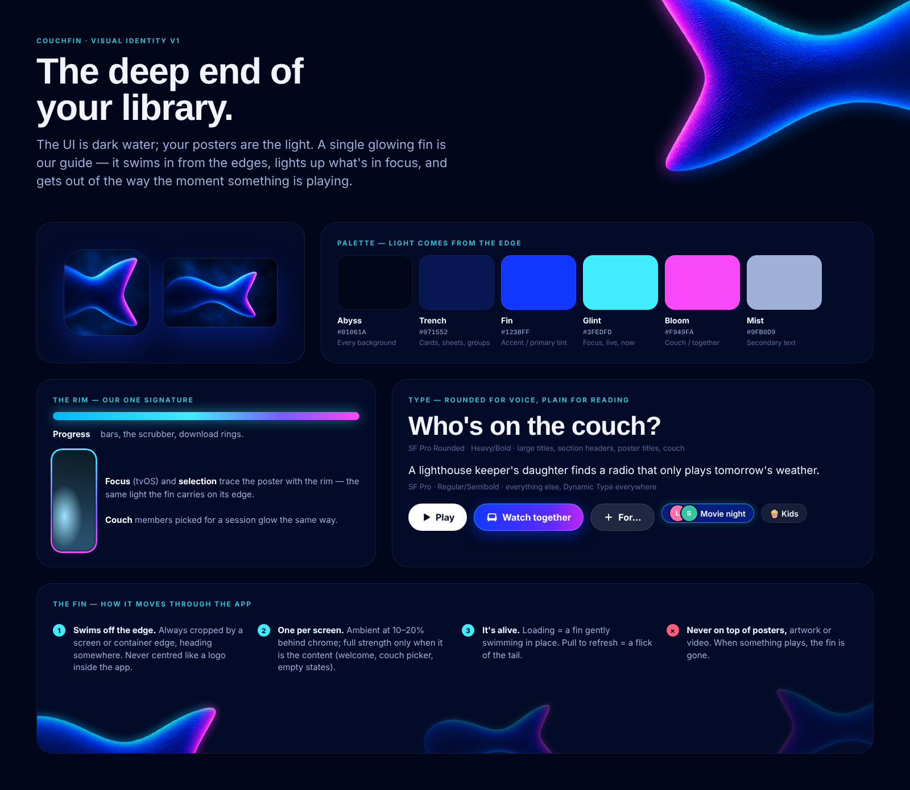
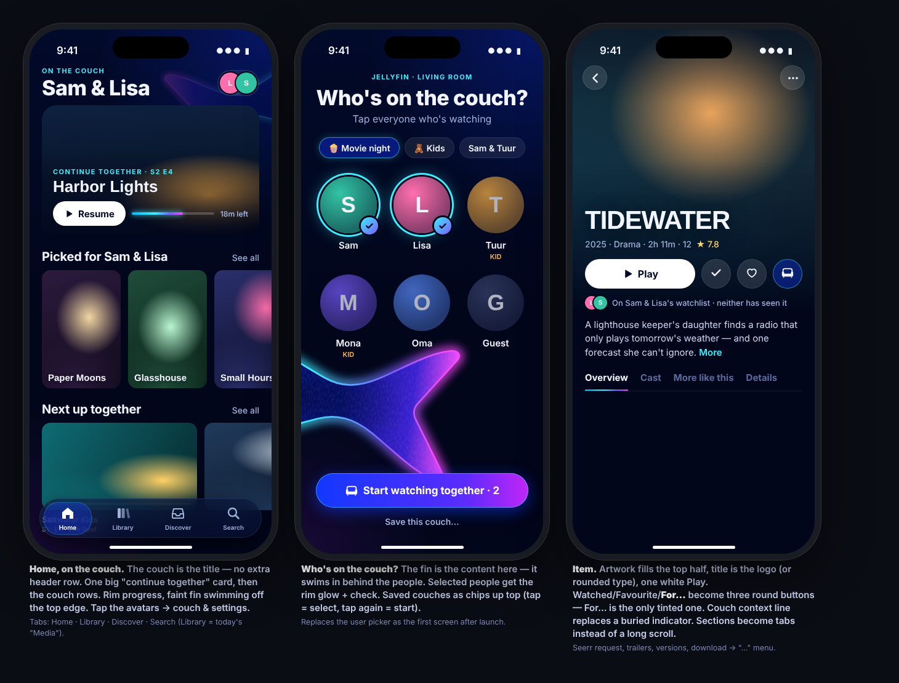
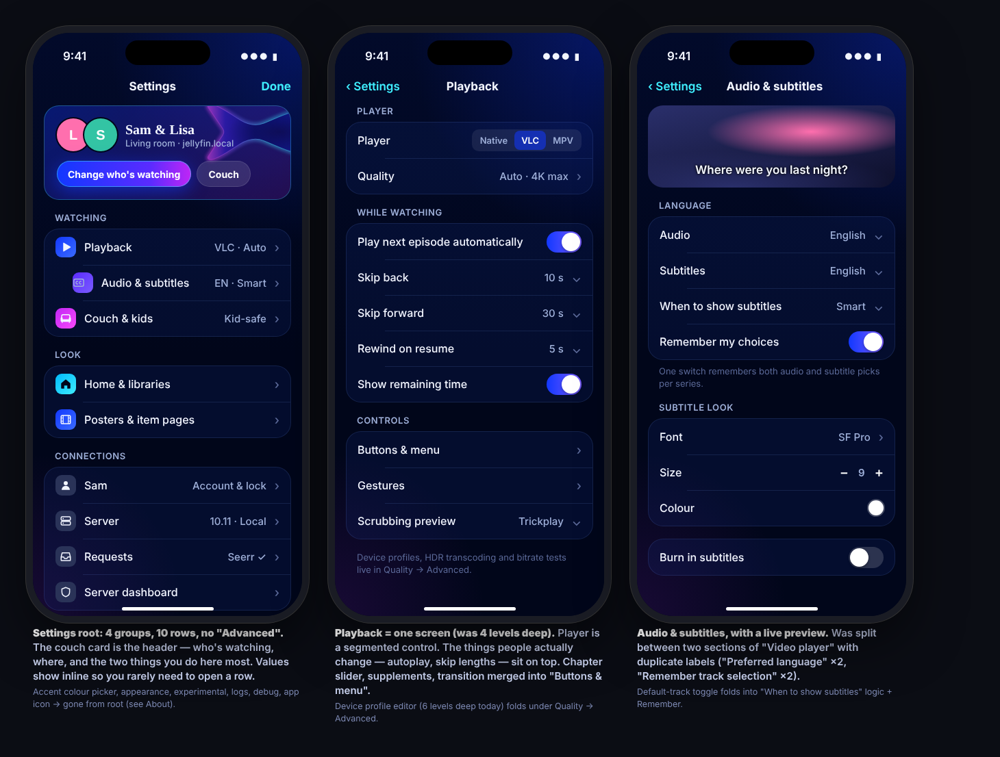
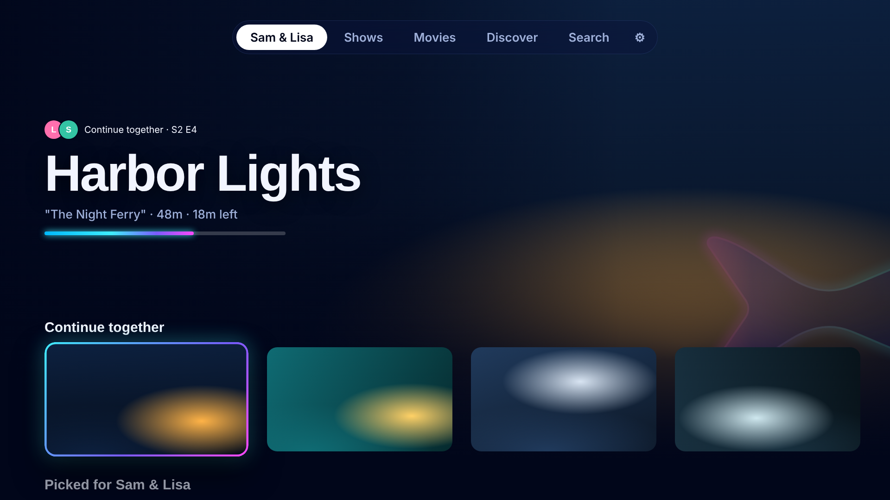
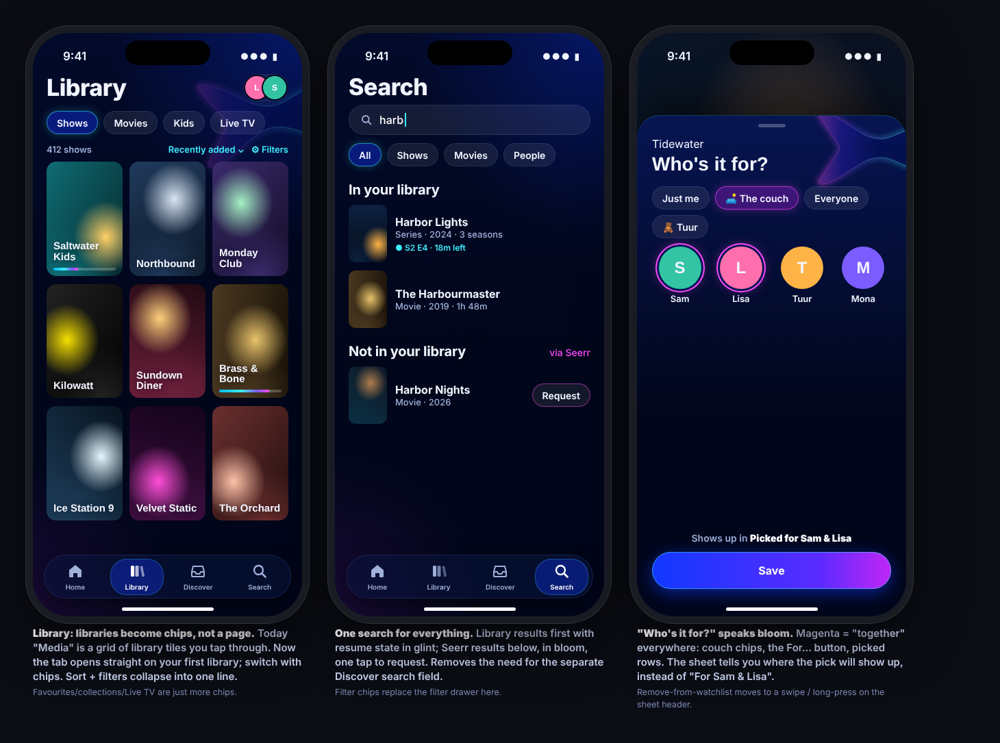
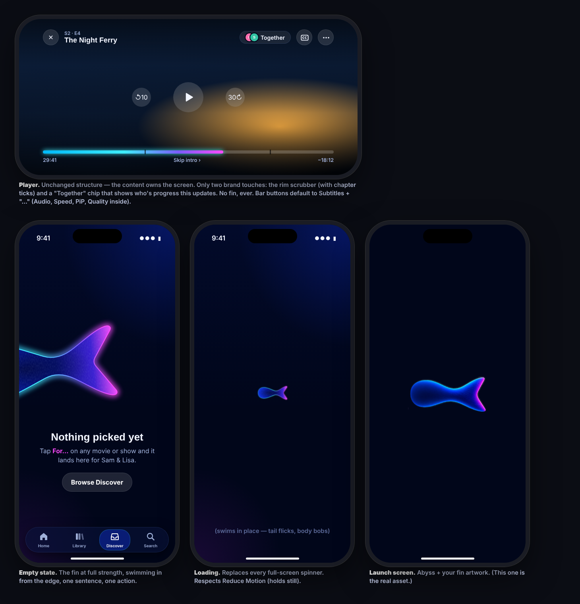

# Couchfin design

**The deep end of your library.** The UI is dark water; posters are the light. One glowing
fin — the app icon — is the guide: it swims in from the edges, lights what's in focus, and
is gone the moment something plays.

| | |
|---|---|
|  |  |
|  |  |
|  |  |

Mockups are HTML (`mockups/*.html`, open in a browser); poster art in them is placeholder.

## Tokens — `Color.Couchfin` (`Shared/Extensions/Color+Couchfin.swift`)

| Token | Hex | Use |
|---|---|---|
| `abyss` | `#01061A` | every background |
| `deep` | `#020D33` | top of the background gradient |
| `trench` | `#071552` | rows, cards, sheets |
| `fin` | `#1238FF` | primary buttons |
| `accent` | `#4C7DFF` | app tint (links, toggles, text) |
| `glint` | `#3FEDFD` | focus, live, now, played |
| `bloom` / `orchid` | `#F949FA` / `#C026F5` | the couch, "together", "Who's it for?" |
| `mist` | `#9FB0D9` | secondary text |
| `rim` | bio → glint → violet → bloom | progress, scrubber, selection, focus |

## Components (`Shared/Components/Couchfin/`)

- `FinShape` — the fin as a `Shape` (100 × 46 design box).
- `FinView(heading:glow:)` — the fin with body gradient, dark core and glowing rim.
- `SwimmingFin` — loading indicator; holds still with Reduce Motion.
- `FinEmptyView` — empty state: fin from the leading edge, title, description, actions.
- `AbyssBackground`, `.couchfinBackground()`, `.couchfinRowBackground()`.

## Rules

1. The fin always swims off an edge — never centred like a logo inside the app
   (launch screen excepted).
2. One fin per screen. Ambient (10–20 %) behind chrome; full strength only when it *is*
   the content: couch picker, empty states, About.
3. Never over artwork or video. The player has no fin.
4. Light comes from the edge: the rim marks progress, focus and selection — nothing else
   glows.
5. Magenta means together. Blue means you.
6. Titles are SF Pro Rounded (heavy/bold); everything else SF Pro with Dynamic Type.

See `settings-audit.md` for the settings & menus consolidation.
